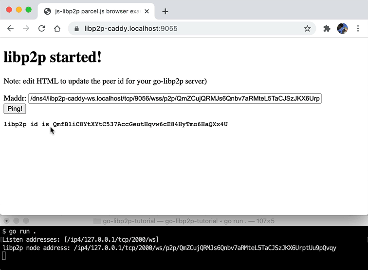

# libp2p-caddy

Use libp2p in the web browser to connect to go-libp2p over SSL via Caddy server.

Based on:

* [https://github.com/libp2p/js-libp2p/tree/master/examples/libp2p-in-the-browser](https://github.com/libp2p/js-libp2p/tree/master/examples/libp2p-in-the-browser)
* [Getting started with go-libp2p](https://docs.libp2p.io/tutorials/getting-started/go/)
* [Getting started with js-libp2p](https://docs.libp2p.io/tutorials/getting-started/javascript/)

# Demo



# Instructions

(tested on OS X with Caddy 2 and Google Chrome)

1. `git clone https://github.com/jimpick/libp2p-caddy.git`

2. `cd libp2p-caddy`

3. `npm install`

4. Modify `/etc/hosts`, add the following entries after localhost (requires admin access):

   ```
   127.0.0.1       localhost libp2p-caddy.localhost libp2p-caddy-ws.localhost
   ```

4. In the first terminal session: `npm start`

   This runs the Parcel bundler, creates static web site on port 1234.

5. In a second terminal session, change directories into `go-libp2p-tutorial` and do: `go run .`

   This will run a very simple go-libp2p based daemon that listens on a websocket on port 2000 and responds to pings. (no SSL)

   When you run it, take a note of the peer ID. It will change every time you run it.

6. In a third terminal, run `caddy run --config Caddyfile.dev` (or `npm run caddy`)

   This will run a developer version of Caddy which will provision SSL certificates for libp2p-caddy.localhost (UI, on port 9055) and libp2p-caddy-ws.localhost (websocket, on port 9056).

7. Edit index.html, replace peer id.

8. Access demo at: https://libp2p-caddy.localhost:9055/


## License

MIT/Apache-2 (Permissive License Stack)

